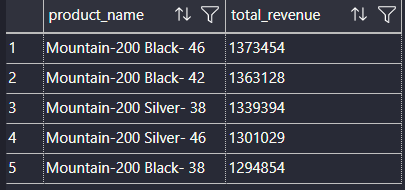

# Ranking Analysis

---

- Order the values of dimensions by measure.
- Top N performers I Bottom N Performers

<aside>

### Which 5 products generate the highest revenue?

```sql
SELECT TOP 5
    dp.product_name,
    SUM(fs.sales_amount) total_revenue
FROM gold.fact_sales fs
LEFT JOIN gold.dim_products dp
ON fs.product_key = dp.product_key
GROUP BY dp.product_name
ORDER BY total_revenue DESC
```



</aside>

<aside>

### What are the 5 worst-performing products in terms of sales?

```sql
SELECT TOP 5
    dp.product_name,
    SUM(fs.sales_amount) total_revenue
FROM gold.fact_sales fs
LEFT JOIN gold.dim_products dp
ON fs.product_key = dp.product_key
GROUP BY dp.product_name
ORDER BY total_revenue ASC
```


</aside>

# Product Details

| Product | QTY | price |
| --- | --- | --- |
| A | 5 | 90 |
| B | 6 | 15 |
| C | 7 | 65 |